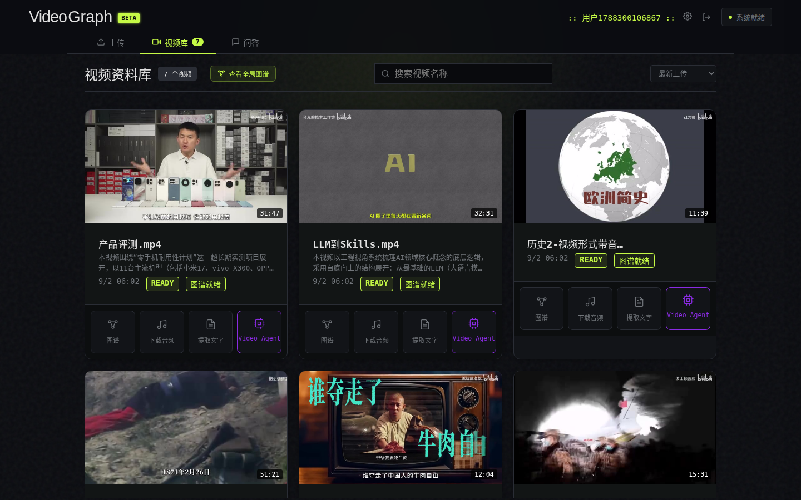
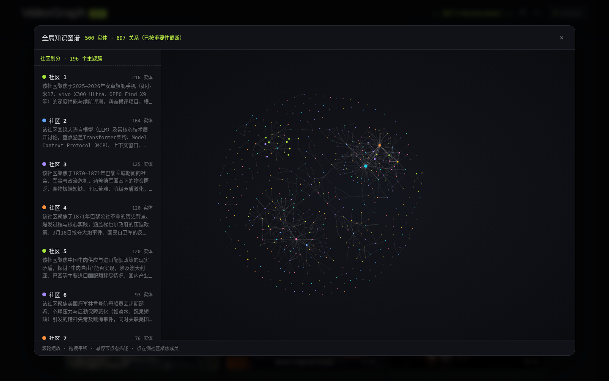
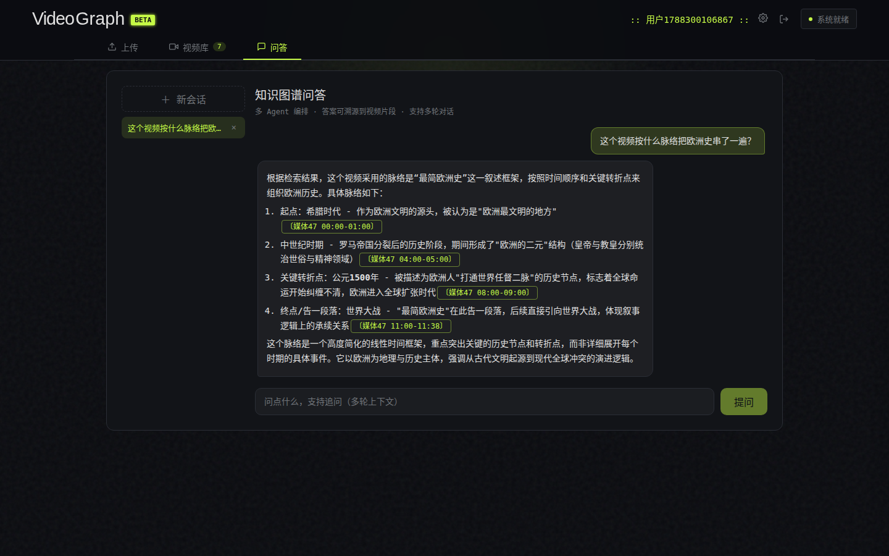

<div align="center">
  <h2>VideoGraph</h2>

  <p>
    <a href="https://github.com/Xiaoc7r/DOVideo-AI/stargazers"></a>
    
    
    
    
    
    
    <a href="./LICENSE"></a>
  </p>
</div>

<div align="center">

视频知识图谱构建与问答系统。

视频经 S3 直传入库后，由消息队列驱动**静音感知分片解析**（ASR + 关键帧 OCR）、LLM 实体关系抽取与**两级实体消解**写入 Neo4j 知识图谱，最终基于**多 Agent 编排**实现可溯源到视频片段的多轮问答，支持多用户数据隔离。

</div>

## 项目预览

**视频资料库（封面 / 时长 / 构建状态 / 内容总结）**



**全局知识图谱（社区划分面板 + 力导图，可缩放/聚焦）**



**多 Agent 问答（内嵌引用锚点，点击回放对应视频片段）**



## 架构

```text
Vue 3 前端（上传 / 视频库 / 问答 三 Tab）
   │  S3 预签名分片直传（XXH3-128 内容指纹：秒传 / 断点续传）
   ▼
Java Spring Boot（编排层）
   │  ├─ MySQL：任务状态机（条件更新事实源）、会话历史
   │  ├─ Redis：心跳 / 进度热数据、Redisson 分布式锁、运行时模型配置
   │  └─ RocketMQ：解析 / 写图 两阶段消息（投递即返回）
   ▼  HTTP 投递 + 回调推进状态
Python FastAPI（AI 计算层）
   │  ├─ 解析：ffmpeg 静音检测分片 → ASR → 关键帧 OCR（无锁并发）
   │  ├─ 抽取：LLM 实体关系 + gleaning 自查补抽（OCR 术语作拼写基准）
   │  ├─ 写图：两级实体消解 → 实体级细粒度锁两阶段提交 → Leiden 社区
   │  └─ 问答：DeepAgents 多 Agent 编排（视频级粗筛 + 多路召回 + RRF + 重排）
   ▼
Neo4j（图谱 + 向量属性） + MinIO（视频 / 关键帧 / 封面）
```

## 核心功能

### 🎬 视频导入
- 前端扩展名 / 魔数（识别真实容器防伪装）/ 大小三重校验，流式计算 XXH3-128 内容指纹（~3GB/s）
- S3 预签名分片直传：秒传、断点续传、ListParts 权威校验、ffprobe 内容校验、Redisson 锁防并发重复写入
- B 站 / YouTube / 抖音链接导入（yt-dlp），上传完成自动生成封面与时长

### ⚙️ 长任务异步编排
- 解析 → 写图两阶段 RocketMQ 消息，投递即返回；MySQL 任务表状态机事实源（全条件更新），Redis 承载心跳/进度
- 看门狗定时对账：卡点超时按指数退避重投；**fencing token（attempt）+ 重试预算拆分**——背压排队不烧重试预算，僵尸执行体心跳/回调双重拦截（Lua 条件写入自我中止）
- 失败任务前端可手动重试（预算重置、立即重投）；卡片展示完整构建生命周期

### 🧩 知识图谱构建
- **静音感知分片**：ffmpeg silencedetect 找语义边界（30–90s 窗口 / 60s 目标），硬切侧 8s 音频补偿，关键帧核心区间唯一归属
- **两级实体消解**：规则层（规范化哈希 + 3-gram Jaccard + 信息熵门控，零 LLM 吃掉 26–44% 明确合并）+ 语义层（批量 LLM 判重，调用量 ↓95%）
- **两阶段提交**：prepare 锁外决策（LLM 全在此，多视频并行）→ apply 实体级细粒度锁写入（KgMultiLock 排序加锁防死锁）；幻影检查防并发重复——11 分钟视频写图 11min → 141s
- **社区发现**：Leiden 算法（固定 seed），增量归属（邻居投票 → 向量+LLM → singleton 保底）+ 每天凌晨全量重建纠偏
- **视频级总结**：analyze 后自动生成整视频内容简介（超长分层压缩）+ 向量，卡片展示与视频级语义检索共用

### 🔍 检索与多 Agent 问答
- **检索漏斗**：L0 视频级粗筛（总结向量，"这题跟哪几个视频有关"）→ 实体关系 / 主题社区 / 原文片段三路召回（均可按候选视频范围过滤）→ RRF 融合 → cross-encoder 精排
- **DeepAgents 编排**：主 Agent 按问题复杂度自主检索（视频级粗筛 / 三路检索），复杂问题并行派发子 Agent（细节研究 / 主题分析）；QuickJS 沙箱供计算
- **可溯源**：答案内嵌〔媒体X mm:ss〕引用锚点，点击从对应时点回放；溯源卡片展示证据帧与原文

### 📊 质量评测
- 自建 50+ 题回归评测集（事实 / 概括 / 多跳 / 细节四类）：检索层 Hit@5 / MRR / 污染率，答案层 RAGAS（faithfulness / relevancy / context recall）
- 独立 BENCH 账号隔离评测环境，每次检索/抽取算法变更后回归

## 技术栈

| 层次 | 技术 |
| :--- | :--- |
| Web | Vue 3、Vite、SSE、vis-network、Marked |
| 编排 | Java 21、Spring Boot 3.5.9、MyBatis-Plus、RocketMQ、Redisson |
| AI 计算 | Python、FastAPI、ffmpeg、Tesseract、DeepAgents（LangChain）、igraph/leidenalg |
| 数据 | MySQL 8、Redis 7、Neo4j 5（图谱+向量）、MinIO（S3）、Qdrant（证据向量） |
| 模型 | 阿里云百炼：qwen-plus（LLM）、qwen3.7-text-embedding、qwen3-omni-flash（ASR）、qwen3.7-text-rerank（OpenAI 兼容协议，可换任意供应商） |

## 本地运行

### 环境要求

JDK 21 · Node.js 22 · Docker Compose v2 · FFmpeg · Tesseract（chi_sim + eng）· yt-dlp（可选）

### 1. 配置

```bash
cp .env.example .env
```

编辑 `.env`：数据库 / Redis / MinIO 密码 + 模型配置。默认走阿里云百炼（一个 key 通吃四项，也兼容 SiliconFlow 等任意 OpenAI 协议供应商）：

```bash
LLM_API_KEY=sk-xxx
LLM_BASE_URL=https://dashscope.aliyuncs.com/compatible-mode/v1
LLM_MODEL=qwen-plus
EMBEDDING_API_KEY=sk-xxx
EMBEDDING_MODEL=qwen3.7-text-embedding
ASR_API_KEY=sk-xxx
ASR_URL=https://dashscope.aliyuncs.com/compatible-mode/v1/chat/completions
ASR_MODEL=qwen3-omni-flash
RERANKER_API_KEY=sk-xxx
RERANKER_BASE_URL=https://dashscope.aliyuncs.com/compatible-api/v1
RERANKER_MODEL=qwen3.7-text-rerank
RERANKER_PATH=/reranks
```

### 2. 启动中间件

```bash
./scripts/dev-up.sh        # MySQL / Redis / MinIO / RocketMQ / Qdrant
docker start neo4j         # Neo4j 独立容器
```

### 3. 启动应用

```bash
./scripts/start-apps.sh    # Python(8000) + Java(9090) + 前端(5173)
```

浏览器访问 `http://localhost:5173`，注册账号后上传视频即可。前端构建状态、图谱可视化、问答均可用。

### 常用命令

```bash
# 只重启 Java / 单独服务
./scripts/start-java.sh

# Redis 调试（任务状态 / 模型运行时配置 / 锁）
docker exec -it dovideo-ai-redis-1 redis-cli -a "$(grep '^REDIS_PASSWORD' .env | cut -d= -f2)" --no-auth-warning

# 检索回归评测（需先 source .env）
EVAL_GROUP_ID=user_4 EVAL_DATASET=ai-service/eval_dataset_bench.json python ai-service/eval_harness.py --save
```

## 目录结构

```text
DOVideo-AI
├── client/              # Vue 3 前端（上传 / 视频库 / 问答 三 Tab）
├── server/              # Java 编排层（状态机 / MQ / 代理 / 任务可靠性）
├── ai-service/          # Python AI 计算层（解析 / 抽取 / 写图 / 检索 / Agent）
│   ├── app/services/    #   核心：pipeline、两跳消歧、检索器、社区、Agent
│   ├── eval_harness.py  #   检索层评测
│   └── experiment/      #   实验与数据脚本
├── docs/                # 设计与联调文档（kg-governance-impl-progress.md 为主）
├── scripts/             # dev-up / start-apps / start-java
└── docker-compose.yml
```

## License

本项目基于 [MIT License](LICENSE) 开源。
